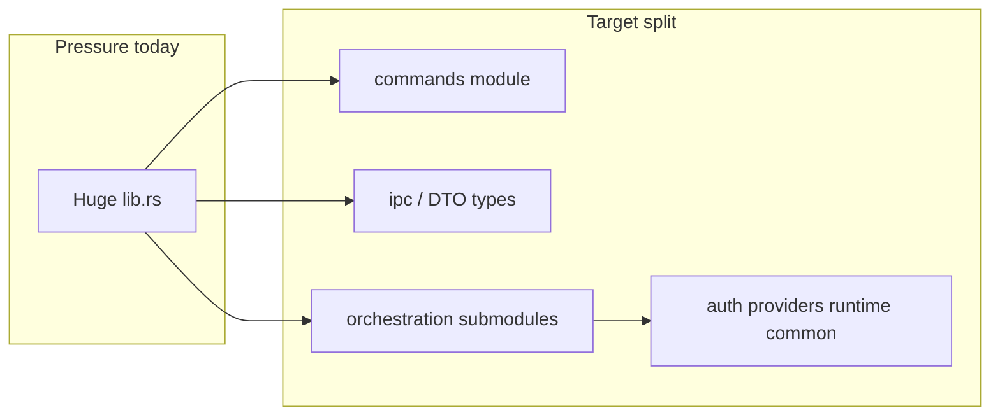

# Tauri backend refactor — roadmap

（日本語: Tauri バックエンドリファクタ — ロードマップ）

Canonical: [`docs/development/tauri-backend-design.md`](../../docs/development/tauri-backend-design.md)

This note sequences work to align [`src-tauri`](../../src-tauri/) with the design policy. The policy defines *what* good looks like; here we only define gaps, phases, acceptance, and **PR slice granularity**.

## Goals (definition of done)

- Move the legacy shape of [`lib.rs`](../../src-tauri/src/lib.rs) (DTOs, orchestration, and command bodies in one huge file) **incrementally** toward the policy **layer table** (Tauri boundary / orchestration / adapters / domain crate).
- **Do not break the IPC contract** (command names, `camelCase` JSON, custom event strings). If a rename or payload change is required, update [`src/`](../../src/) `invoke` / listeners in the **same PR** or with an explicit compatibility strategy (policy: Frontend contract / Review standard).
- **Acceptance (required) for each slice (target: 1 PR per slice):**
  - `cargo build` in `src-tauri` (or CI-equivalent `cargo check --all-targets`)
  - `npm run ui:build` when the change touches the frontend contract
  - No behaviour change; manual smoke for the area you touched (remotes list, library, download, upload, auth, diagnostics export)

## PR granularity (phases vs slices)

- **Phase numbers are logical groupings** (“what we batch conceptually”). **Default merge unit: one slice = one PR** (reviewable size, passes acceptance above).
- If a slice is still too large, **split further** (e.g. two PRs for slice 3-2 Part A / Part B). If changes are purely mechanical and low-risk, **combine multiple slices in one PR**—but still satisfy acceptance.
- **Phase 0** may be **documentation / baseline only** (no PR required).
- **Phase 5** is a **series of many PRs** (one extraction per PR by default).
- **Phase 6** is mainly **review alongside other slice PRs**; add **one final audit PR** if useful.

## Current gaps (starting point)

| Gap | Where policy puts it | Today |
| --- | -------------------- | ----- |
| Shell + orchestration in one place | Thin `run()`, logic in modules | [`lib.rs`](../../src-tauri/src/lib.rs) holds DTOs, `#[tauri::command]`, `*_impl`, threads, polling, emits |
| Thin command boundary | Validate → delegate | Commands already delegate via `spawn_blocking` → `*_impl`, but `*_impl` bodies are huge in one file |
| Custom events | Names are part of the API | Constants live near top of `lib.rs`; room to **module + list** them |
| Internal crate | Tauri-free pure logic | [`rclone_logic`](../../src-tauri/crates/rclone_logic/) exists; more pure helpers could move out of `lib.rs` |
| Security | Match [`capabilities/default.json`](../../src-tauri/capabilities/default.json) | When refactoring, **do not add** new shell/rclone patterns without updating capabilities |

## Phase 0 — Baseline and guardrails

**Policy:** Stability policy, Review standard.

- Record **`cargo build` (`src-tauri`)** and optional full-app notes for regression comparison. **PR optional.**
- Every later PR: one line on **which layer** you moved work to, and **which section of the canonical doc** it maps to.
- Any **IPC change** must be checked against [`src/`](../../src/) call sites and types.

## Phase 1 — Surface IPC explicitly (low risk)

**Target: slice 1 = 1 PR**

**Policy:** Frontend contract (custom events), Commands (single registration site).

- Move **event name constants** (e.g. `download://progress`, `upload://progress`, `library://progress`) from `lib.rs` into a **dedicated module** (e.g. `src-tauri/src/ipc/events.rs`). Behaviour unchanged; imports only.
- Add a short comment that **`generate_handler!` stays in one place** when splitting modules.
- **Accept:** build passes; event string values unchanged (verify with grep).

## Phase 2 — Extract IPC types (DTOs) (low–medium risk)

**Policy:** Frontend contract (`camelCase`), Internal crates (clear boundaries).

- Move **Serde types** shared with the frontend from `lib.rs` into **`src-tauri/src/ipc/`** or split `types` files. Keep `#[serde(rename_all = "camelCase")]`.
- Keep **internal-only** structs next to orchestration modules or split files by responsibility.
- **If there are many DTOs:** split PRs by **type group** (e.g. storage list / transfers / diagnostics)—still logically “phase 2”, merge in order.
- **Accept:** JSON shape unchanged (spot-check TS types); build passes.

## Phase 3 — Split `#[tauri::command]` and `*_impl` (medium)

**Policy:** Commands (thin boundary), Layer model (orchestration).

**Direction:** submodule per domain; each command keeps **validate → `*_impl` or service fn**; move `*_impl` bodies into the right module. Call [`auth_flow.rs`](../../src-tauri/src/auth_flow.rs), [`auth_session.rs`](../../src-tauri/src/auth_session.rs), [`providers/`](../../src-tauri/src/providers/), [`rclone_runtime.rs`](../../src-tauri/src/rclone_runtime.rs), [`backend_common.rs`](../../src-tauri/src/backend_common.rs) **explicitly** from the new layout.

**Slices (each target 1 PR):**

| Slice | Scope (example) | Accept |
| ----- | ---------------- | ------ |
| 3-1 | Storage list / remotes (e.g. `list_storage_remotes`, `delete_remote` + related `*_impl`) | `invoke` names/signatures unchanged; `cargo build`; smoke remotes + delete |
| 3-2 | Auth / OneDrive / session (e.g. `create_onedrive_remote`, `reconnect_remote`, `get_auth_session_status`, drive candidates, `finalize_*` + `*_impl`) | Same; smoke auth / reconnect |
| 3-3 | Library listing (e.g. `list_unified_items`, `start_unified_library_load` + `*_impl`) | Same; smoke library + stream start |
| 3-4 | Download / open (e.g. `start_download`, `prepare_open_file` + `*_impl`) | Same; smoke DL + preview |
| 3-5 | Upload (e.g. `prepare_upload_batch`, `start_upload_batch` + `*_impl`) | Same; smoke upload |
| 3-6 | Diagnostics (e.g. `export_diagnostics` + `*_impl`) | Same; smoke diagnostics export |

You may regroup commands vs the table for implementation reasons; keep **each PR reviewably small**.

## Phase 4 — Isolate long orchestration flows (medium–large)

**Policy:** Layer model (orchestration), Anti-patterns (avoid huge inline flows).

**Direction:** **threads, polling, channels, progress emit** for one feature → **one module or `struct` + `impl`**. Do **not** add raw `std::process` / rclone bypass; use [`rclone_runtime`](../../src-tauri/src/rclone_runtime.rs).

**Slices (each target 1 PR):**

| Slice | Scope (example) | Accept |
| ----- | ---------------- | ------ |
| 4-1 | Unified library load stream (emit + background work) | Event payloads and user-facing messages unchanged; no obvious perf regression |
| 4-2 | Download progress polling, etc. | Same |
| 4-3 | Upload batch / progress | Same |
| 4-4 | Any other long flow left in `lib.rs` | Same |

Apply phase 4 **after** phase 3 if large flows remain in a single file.

## Phase 5 — Domain crate and pure logic (optional, ongoing)

**Policy:** Internal crates, role of `rclone_logic`.

- Move more **parse / classify / pure transforms** into [`crates/rclone_logic`](../../src-tauri/crates/rclone_logic/) (no Tauri dependency).
- Move **testable pure helpers** out of `lib.rs` into the crate or testable `src-tauri/src/` modules.
- **Granularity:** **one extraction = one PR** (phase 5 is many PRs).
- **Accept:** `rclone_logic` does not depend on `tauri`; tests still pass or new tests cover moves.

## Phase 6 — Security, capabilities, logging audit

**Policy:** Security, Logging, Plugins and configuration.

- **Default:** when slice 3-x / 4-x touches **shell args, plugins, or new commands**, verify **[`capabilities/default.json`](../../src-tauri/capabilities/default.json)** and **redaction** in the **same or follow-up PR**.
- Check **log / diagnostics paths** against [`backend_common.rs`](../../src-tauri/src/backend_common.rs) redaction rules on every relevant diff.
- **Optional final audit:** one **summary audit PR** after all slices (even checklist-only).
- **Accept:** at least one line in the PR explaining permissions are minimal necessary.

## Phase 7 — “Done” review

**Target: slice 7 = 1 PR (docs-only OK)**

**Policy:** Review standard (native side).

- Confirm new code placement against the **Layer model** table in [`tauri-backend-design.md`](../../docs/development/tauri-backend-design.md).
- Append **completion date + final commit range** in one line at the end of this roadmap to close it.

## 実装ステータス（現在地）

- **完了:** Phase 1（slice 1, 1PR）実装済み。
  - `lib.rs` から progress イベント定数を `src-tauri/src/ipc/events.rs` へ移動。
  - `src-tauri/src/ipc/mod.rs` を追加して `lib.rs` から `use crate::ipc::events::{...};` 参照に切替。
  - `run()` の `generate_handler!` 前に「登録箇所を 1 箇所に維持する」コメントを追加。
  - `cargo build` 通過、イベント文字列不変、`generate_handler!` 単一箇所を確認済み。
- **完了（作業ツリー反映）:** Phase 2（DTO 抽出）を一括で実装。
  - `src-tauri/src/ipc/types.rs` を新設し、`lib.rs` 先頭の Serde DTO 群を移動。
  - `src-tauri/src/ipc/mod.rs` に `pub mod types;` を追加。
  - `lib.rs` は `use crate::ipc::types::*;` 参照へ切替し、DTO 定義本体を削除。
  - `#[serde(rename_all = "camelCase")]` を移動先で維持（`ipc/types.rs` 側で確認）。
  - `cargo build` 通過、`lib.rs` から Serde DTO derive が消えていることを確認。
- **完了（作業ツリー反映）:** Phase 3 / slice 3-1（Storage list / remotes）を実装。
  - `src-tauri/src/remotes.rs` を新設し、`list_storage_remotes` / `delete_remote` の command + `*_impl` を `lib.rs` から移動。
  - `lib.rs` に `mod remotes;` を追加し、`generate_handler!` は既存の単一箇所を維持。
  - `export_diagnostics_impl` が参照する `list_storage_remotes_impl` は `remotes` モジュール側の実装を利用する構成に更新。
  - `validate_remote_name` / `remote_status` / `remote_status_message` を `pub(crate)` にして、分割後も同一ロジックを再利用。
  - `cargo build` 通過。`list_storage_remotes` / `delete_remote` / 各 `*_impl` が `remotes.rs` に移動していることを確認。
- **対応コミット（Phase 1）:** `85a94f4` (`refactor(tauri): extract IPC progress event constants`)
- **対応コミット（Phase 3 / slice 3-1）:** `6da3716` (`refactor(tauri): split remotes commands into module`)
- **完了:** Phase 3 / slice 3-2（auth / onedrive / session）を実装。
  - `src-tauri/src/auth_remotes.rs` を新設し、`create_onedrive_remote`, `reconnect_remote`, `get_auth_session_status`, `list_onedrive_drive_candidates`, `finalize_onedrive_remote` と各 `*_impl` を `lib.rs` から移動。
  - `lib.rs` に `mod auth_remotes;` と `use crate::auth_remotes::{...};` を追加し、`generate_handler!` は単一箇所のまま。
  - `lib.rs` の import から、移動先のみで使う `start_auth_flow` / `providers::onedrive` / `get_auth_session_record` 等を整理。
  - `cargo build` 通過。
- **対応コミット（Phase 3 / slice 3-2）:** `45071de` (`refactor(tauri): split OneDrive auth commands into auth_remotes module`)
- **補足:** 設計正典 [`tauri-backend-design.md`](../../docs/development/tauri-backend-design.md) のレイヤ表・カスタムイベント節を slice 3-2 に合わせて更新。
- **完了:** Phase 3 / slice 3-3（library listing）を実装。
  - `src-tauri/src/unified_library.rs` を新設し、`list_unified_items`, `start_unified_library_load` と各 `*_impl`、OneDrive 列挙ヘルパー、`emit_library_progress` を `lib.rs` から移動。
  - `list_connected_remote_targets` と `RemoteLoadTarget` はアップロード準備・診断でも使うため `pub(crate)` で同モジュールに集約し、`lib.rs` から `use crate::unified_library::{...}` で参照。
  - `mark_remote_reconnect_required` を `pub(crate)` にし、ストリーム失敗時の再接続フラグを維持。
  - `cargo build` 通過。
- **対応コミット（Phase 3 / slice 3-3）:** `411d544` (`refactor(tauri): split unified library commands into unified_library module`)
- **補足:** 設計正典の Orchestration 行に `unified_library.rs` を追記。
- **完了:** Phase 3 の残り（旧 slice 3-4〜3-6 相当）を一括実装。
  - `src-tauri/src/transfers.rs` に `start_download`, `prepare_open_file`, `prepare_upload_batch`, `start_upload_batch` と各 `*_impl`、ダウンロード進捗・オープンキャッシュ・アップロードルーティング一式を集約。
  - `src-tauri/src/diagnostics.rs` に `export_diagnostics` と ZIP 出力ヘルパーを集約。
  - `lib.rs` は `run()`、`generate_handler!`、リモート状態ヘルパー（`validate_remote_name` / `remote_status` / `mark_remote_reconnect_required` 等）に縮小。
  - `remotes.rs` の `rclone_runtime` 参照を `crate::rclone_runtime::...` に修正。
  - `cargo build` 通過。
- **対応コミット（Phase 3 / slice 3-4〜3-6 一括）:** `61122a2` (`refactor(tauri): extract transfers and diagnostics from lib.rs`)

- **完了:** Phase 4（長大オーケストレーションのモジュール分離）を実装。
  - **4-1:** `src-tauri/src/unified_library/load_stream.rs` にライブラリ負荷のバックグラウンドスレッド・チャネル集約・`LIBRARY_PROGRESS_EVENT` emit を集約。`unified_library/mod.rs` は列挙・OneDrive ワーカー・コマンド境界を維持。
  - **4-2:** `src-tauri/src/transfers/download.rs` に `spawn_download_task`、進捗ポーリング、`DOWNLOAD_PROGRESS_EVENT` を集約。
  - **4-3:** `src-tauri/src/transfers/upload.rs` に `spawn_upload_task`、`upload_prepared_item`、候補リトライと `UPLOAD_PROGRESS_EVENT` を集約。`mark_remote_reconnect_required` は従来どおり `lib.rs` 経由。
  - **4-4（監査）:** `thread::spawn` は `unified_library/load_stream.rs`（負荷ストリーム）、`unified_library/mod.rs`（OneDrive フォルダワーカー）、`transfers/download.rs`、`transfers/upload.rs`、および **`auth_flow.rs`（認証フロー用）** に残存。`lib.rs` に長大オーケストレーションはなし（`run()` / `generate_handler!` / リモート状態ヘルパーのみ）。認証側の分離は Phase 4 スコープ外とし、必要なら今後のスライスで追跡。
  - `cargo build` / `cargo test` 通過。
- **対応コミット（Phase 4 一括）:** `ba8dc7b` (`refactor(tauri): isolate Phase 4 orchestration (library load stream, transfers)`)

- **完了:** Phase 5（ドメインクレートへの純ロジック移管）を実装（初回スライス）。
  - `src-tauri/crates/rclone_logic/src/transfer_paths.rs` を追加し、Tauri 非依存のヘルパーを集約: `join_remote_path`、`completion_progress`、`UploadRemoteCapacity` と `rank_upload_remotes_by_capacity`、`providers_for_extension`、`category_base_path`、`default_upload_routing_tables`、`select_leaf_file_name`、`sanitize_open_cache_stem`、`open_cache_key_suffix`、`select_preview_open_mode`。
  - `rclone_logic` の `lib.rs` から上記を再エクスポート。`transfers` は I/O・`rclone_runtime`・emit を残し、重複実装を削除（単体テストは `rclone_logic` の `transfer_paths` テストへ移管）。
  - 設計正典 [`tauri-backend-design.md`](../../docs/development/tauri-backend-design.md) の Domain crate 行に `transfer_paths.rs` を追記。
  - `cargo test`（`app` + `rclone_logic`）通過。`rclone_logic` は引き続き `tauri` に依存しない。
- **対応コミット（Phase 5 初回）:** `4827bd6` (`refactor(rclone_logic): extract transfer path and routing pure helpers (Phase 5)`)

- **完了:** Phase 6（セキュリティ・capabilities・ログ／診断監査）を実装。
  - `capabilities/default.json` の `shell:allow-execute`（sidecar `binaries/rclone`）と `rclone_runtime` 経由の全サブコマンドを突合し、**未カバーなし**（JSON 変更なし）。
  - [`docs/development/tauri-backend-design.md`](../../docs/development/tauri-backend-design.md) に **Rclone sidecar: code vs default.json** の対応表と、権限が `core` / `dialog` / `shell`（許可パターンのみ）に限定される旨を追記。
  - [`backend_common.rs`](../../src-tauri/src/backend_common.rs): `redact_args` に `client_id=`、`summarize_output` に doc コメント、単体テスト（redact / 長さ截断）。
  - [`diagnostics.rs`](../../src-tauri/src/diagnostics.rs): 診断 ZIP の `summary.json` / 任意の `cloud-weave.log` はユーザー環境のパスやストレージ名を含み得る旨のコメント。
  - **受入れ（PR）:** 追加権限なし；`default.json` は既存パターンのみで最小限。
- **対応コミット（Phase 6）:** `f6e8423` (`security(audit): Phase 6 capabilities alignment, redaction, docs`)

## 次にやるべきステップ

- **推奨着手:** Phase 7（「Done」レビュー：レイヤ表との最終確認、ロードマップ末尾に完了日・コミット範囲の 1 行）。
- **任意:** Phase 5 の追加抽出（他モジュールの純関数を `rclone_logic` へ）。

## Out of scope (common traps)

- **Breaking renames** of commands or JSON fields **only** for cleanup (without a compatibility story).
- **Major Tauri upgrades** as part of this roadmap (separate plan).
- **Frontend responsibility split** (see [`react-responsibility-separation.md`](../../docs/development/react-responsibility-separation.md)).

## Related docs

- [`docs/development/tauri-backend-design.md`](../../docs/development/tauri-backend-design.md) — canonical policy
- [`docs/development/react-responsibility-separation.md`](../../docs/development/react-responsibility-separation.md) — frontend `invoke` / event listeners
