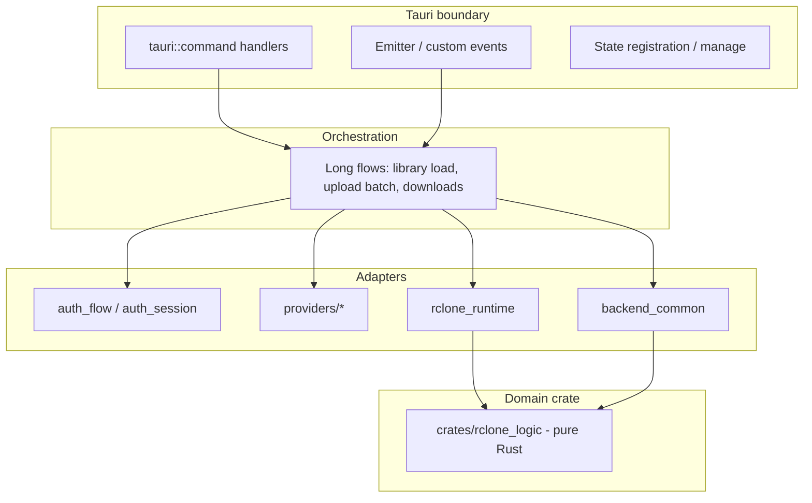

# Tauri backend design (Rust / `src-tauri`)

**Audience:** Engineers working in `[src-tauri/](../../src-tauri/)` (Tauri 2, Rust).

This document is a **long-lived design policy** for the native side of Cloud Weave: where responsibilities live, how the frontend contract works, and security expectations. It is **not** a step-by-step refactor plan; migration sequencing belongs in separate notes.

**Related frontend policy:** `[react-responsibility-separation.md](react-responsibility-separation.md)` (how `src/` consumes `invoke`, listeners, and state).

## Goal

- Keep the **IPC surface** (command names, JSON shapes, custom events) **stable and predictable** as features grow.
- Separate **Tauri wiring** (commands, managed state, plugins, setup) from **domain logic** and from **process / I/O** details.
- Make new code easy to place: pick a layer first, then implement.

## Stability policy

- Treat this file as **engineering policy**, not a one-off migration note.
- Apply it to **new** commands, modules, plugins, and capabilities changes.
- Prefer **incremental alignment** (small PRs) over large rewrites.
- If the tree cannot follow every rule yet, **document the gap** (issue or note) instead of silently diverging. Large legacy modules are acceptable as long as **new** work follows the model below.

## Layer model

Think in four bands. Code may move between bands over time; the rule is **dependencies point inward** (domain crates do not depend on Tauri).

| Layer              | Responsibility                                                                    | Cloud Weave reference locations                                                                              |
| ------------------ | --------------------------------------------------------------------------------- | ------------------------------------------------------------------------------------------------------------ |
| **Entry**          | OS entry only; no app logic                                                       | `[src-tauri/src/main.rs](../../src-tauri/src/main.rs)` delegates to `app_lib::run()`                         |
| **Tauri shell**    | `run()`: plugins, `setup`, `.manage()`, `invoke_handler`                          | `[src-tauri/src/lib.rs](../../src-tauri/src/lib.rs)`                                                         |
| **Orchestration**  | Command bodies, threading, progress polling, mapping to user-visible results      | Same crate, preferably **factored out** of the shell over time (functions / submodules)                      |
| **Auth / session** | OAuth-style flows, persisted session records                                      | `[auth_flow.rs](../../src-tauri/src/auth_flow.rs)`, `[auth_session.rs](../../src-tauri/src/auth_session.rs)` |
| **Providers**      | Provider-specific post-auth and validation                                        | `[providers/](../../src-tauri/src/providers/)` (e.g. OneDrive)                                               |
| **Runtime**        | Spawning rclone, timeouts, collecting output                                      | `[rclone_runtime.rs](../../src-tauri/src/rclone_runtime.rs)`                                                 |
| **Backend common** | Paths via Tauri APIs, config file locations, redaction, shared validation helpers | `[backend_common.rs](../../src-tauri/src/backend_common.rs)`                                                 |
| **Domain crate**   | Parsing, classification, pure types; **no `tauri` dependency**                    | `[crates/rclone_logic/](../../src-tauri/crates/rclone_logic/)`                                               |

*Note:* Today `[lib.rs](../../src-tauri/src/lib.rs)` also holds substantial orchestration and DTOs. That concentration is **legacy shape**, not the target end-state. New work should still **default** to the placements in the table even if older code has not been split yet.

## Frontend contract

### Command names

- Rust `#[tauri::command]` functions use `**snake_case`** identifiers.
- The frontend calls `invoke` with the **same string** as that identifier (e.g. `invoke('list_storage_remotes', …)`).
- Renaming a command is a **breaking IPC change**; treat it like a public API (coordinate with `src/`).

### JSON payloads

- Prefer `**#[serde(rename_all = "camelCase")]`** on types shared across the boundary so payloads match TypeScript conventions in `[src/](../../src/)`.
- If a field must differ, document **why** next to the type (avoid accidental drift).

### Custom events

- Event names are part of the **public contract** (e.g. progress channels implemented as custom events). Changing them breaks listeners in the webview.
- Use a **stable, namespaced pattern** (e.g. `scheme://topic`) so grep and documentation stay clear.
- In this repo, examples include `download://progress`, `upload://progress`, and `library://progress` (see constants near the command implementations in `[lib.rs](../../src-tauri/src/lib.rs)`). New events should follow the same style.

## Commands (`#[tauri::command]`)

- **Thin boundary, fat helpers:** validate inputs, call orchestration or adapter functions, return `Result<T, String>` (or a dedicated error type if introduced later). Avoid hundreds of lines inside a single command without modular breakdown.
- **Errors:** Returning `String` for failures is the current style; keep messages **user-safe** (no raw tokens). Structured errors can be adopted later without abandoning the thin-boundary rule.
- **Async / blocking:** Prefer patterns that keep the UI responsive (Tauri 2 async commands when appropriate). Long synchronous work belongs behind explicit threading or async boundaries, not unbounded blocking on the command path without justification.

Commands are registered in one place (e.g. `invoke_handler` / `generate_handler!` in `[lib.rs](../../src-tauri/src/lib.rs)`); **new commands must be added there** and reflected in frontend `invoke` usage.

## State and concurrency

- Resolve filesystem locations with `**AppHandle`** / `Manager` path APIs (`app_data_dir`, `app_log_dir`, etc.), not hard-coded user paths.
- State registered with `.manage()` must be `**Send` and safe across threads** as required by Tauri (often `Mutex`-wrapped stores).
- Put **only** data that truly needs process-wide sharing in managed state (e.g. auth session stores). Prefer passing `AppHandle` into functions over hidden globals.

## Security

### Capabilities

- `**[src-tauri/capabilities/default.json](../../src-tauri/capabilities/default.json)`** is the **source of truth** for what the webview may invoke (shell sidecar args, dialog, core APIs, etc.).
- Any new **plugin**, **permission**, or **executable/sidecar** surface must be reflected here. Merging a feature without updating capabilities is a security and runtime bug.

### Secrets and logs

- Never log raw **tokens**, **client secrets**, or full **rclone JSON** that may contain credentials.
- Follow the redaction mindset of `[backend_common.rs](../../src-tauri/src/backend_common.rs)` (`redact_args`, `summarize_output`): arguments and subprocess output should be **sanitized** before logging or embedding in diagnostics bundles.

### Diagnostics vs normal logs

- **Diagnostics** exports exist for user support; they must still respect redaction rules and avoid duplicating secrets from config or session stores.
- **Application logs** (`log` + `tauri-plugin-log`) are for engineering diagnosis; configure targets in `run()` and keep paths derived from Tauri APIs.

## Plugins and configuration

- `**tauri.conf.json`**: app identity, bundle, allowlists referenced at build/packaging time.
- `**build.rs`**: build-time hooks (e.g. Tauri’s codegen). Keep **runtime** behavior in Rust modules, not in `build.rs`, unless it is truly compile-time.
- Adding a plugin requires **Rust registration**, **capabilities**, and often **frontend registration**; treat all three as one change set.

## Internal crates (`src-tauri/crates/*`)

- Prefer **no `tauri` dependency** in internal crates so logic stays unit-testable and reusable.
- Use them for **parsers**, **pure transforms**, and **shared types** that should not know about windows or IPC.
- Example: `[rclone_logic](../../src-tauri/crates/rclone_logic/)` for list/unified-item parsing and error classification.

## Logging

- Use the `log` facade; configure sinks via **tauri-plugin-log** in application `run()`.
- Log file location should come from `**app_log_dir`** (or equivalent), not guessed paths.

## Anti-patterns

- Letting `[lib.rs](../../src-tauri/src/lib.rs)` grow without bound as the only home for **all** commands, DTOs, and orchestration (new code should still prefer extraction).
- Embedding **large business flows** inline in command attributes with minimal factoring.
- Shipping **new sidecar args or shell powers** without updating `**[default.json](../../src-tauri/capabilities/default.json)`**.
- Spawning `**rclone`** (or other tools) **outside** the centralized runtime helpers, bypassing timeouts and logging conventions.
- JSON field naming that **does not match** the frontend (`camelCase`) without an explicit, documented exception.

## Review standard (native side)

A change is in good shape when:

- IPC contract changes are **paired** with `src/` updates (or are backward compatible by design).
- Capabilities match new surface area.
- Secrets are not logged or exported in diagnostics.
- New modules fit the **layer table** above (or the PR explains the temporary exception).

## Related documentation

- `**[react-responsibility-separation.md](react-responsibility-separation.md)`** — frontend layers, `invoke`, and event listeners.

